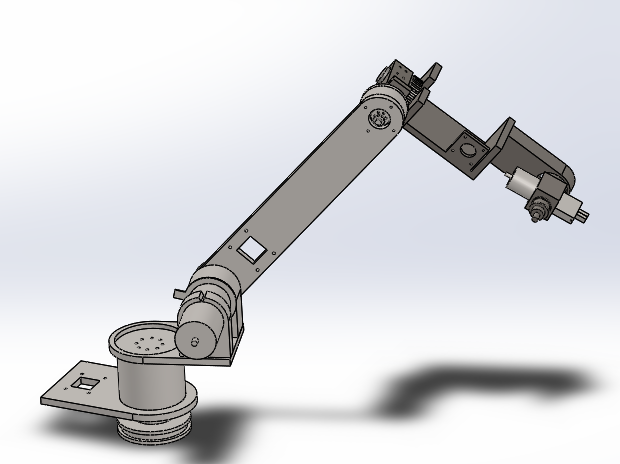
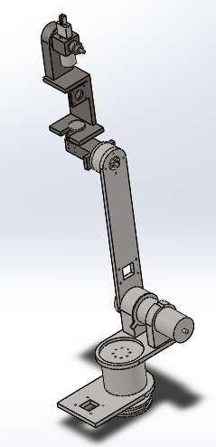

# 6-D.O.F. robotic manipulator
Design the robotic manipulator in SolidWorks. Simulate it in ROS and Gazebo using joint position controller.
Use test_gazebo.launch file to run the whole program. The launch program will spawn the model in gazebo and RViz. 

     
